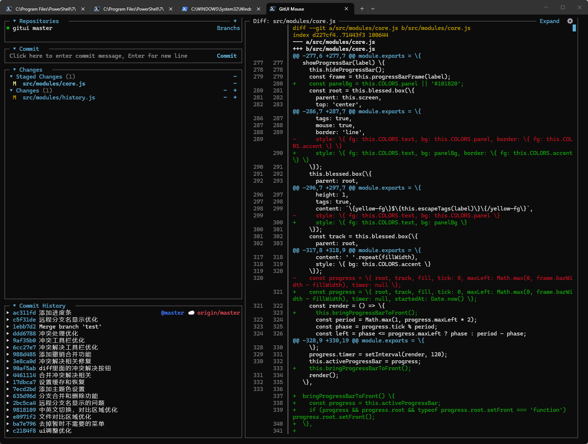

# Gitmous

**A Git client for completing everyday Git work in the terminal with mouse input, buttons, and menus.** Gitmous brings the workflow of a graphical source-control panel into the terminal: point, click, inspect, and confirm. No Git command memorization is required for everyday work.



English | [简体中文](./README.zh-CN.md)

## Work With Git In The Terminal

Gitmous lets you complete everyday Git work in the terminal through mouse input, buttons, menus, and dialogs. Section headers, file controls, diffs, and conflict tools are clickable. Text values such as a commit message, branch name, or remote URL are entered in the application's input box, without manually typing Git or shell commands.

`Ctrl+C` exits the application.

## What You Can Do

| Area | Actions Available In The Terminal |
| --- | --- |
| Repositories | Discover repositories under the current directory, add a local repository, initialize one, or clone from a remote URL. |
| Changes | Click files to stage or unstage; inspect workspace diffs; stage all, unstage all, and discard one or all changes with confirmation. |
| Commits | Create a commit, inspect commit metadata, browse files in a commit, copy hashes or messages, and reset to a selected commit. |
| Branches | Create, switch, publish, merge, and delete local or remote branches. |
| Remote work | Fetch, pull, push, publish the current branch, add or remove remotes, and inspect remote details. |
| Stashes and tags | Create, apply, pop, inspect, or delete stashes; create and delete tags. |
| Conflicts | Accept the current or incoming version, abort a merge, or mark a manually edited file as resolved. |
| Appearance | Switch between English and Simplified Chinese and set the theme accent color. |

Every action that can discard local work or rewrite history asks for confirmation before Git is invoked.

## Platforms And Requirements

Gitmous runs wherever Node.js and Git are available.

- **macOS:** supported. Install Node.js and Git with Homebrew: `brew install node git`. Terminal and iTerm2 are suitable choices.
- **Windows:** Windows Terminal is recommended. Install Node.js and Git, ensuring `git` is available on `PATH`.
- **Linux:** install Node.js 18+ and Git through your distribution package manager.

A terminal with mouse reporting support is required. Node.js 18 or later is supported.

## Install From npm

After the package is published, install it once and use it from any Git repository:

```sh
npm install --global gitmous
gitmous /path/to/your-repository
```

macOS example:

```sh
gitmous ~/Code/your-repository
```

Windows PowerShell example:

```powershell
gitmous D:\github\your-repository
```

You can also run it without a global installation:

```sh
npx gitmous /path/to/your-repository
```

When no path is provided, Gitmous uses the current directory and discovers Git repositories up to two levels below it.

## First Use

1. Launch the application in a repository or its parent directory.
2. Select a repository in **Repositories**.
3. Click a file under **Changes** to stage it, or use **View** to inspect its diff.
4. Enter a message and click **Commit**.
5. Use the top **Actions** menu for remote, branch, merge, stash, tag, and history operations.

Click a section title to collapse or expand it. The `...` button beside a section title opens actions relevant to that panel.

## Local Development

```sh
git clone https://github.com/JackyWongX/gitmous.git
cd gitmous
npm install
npm start -- /path/to/your-repository
npm run check
```

## Configuration

Settings persist the selected language, accent color, and diff-panel preference. On Windows they are stored at `%APPDATA%\gitmous\settings.json`; on macOS and Linux they are stored at `~/.config/gitmous/settings.json`.

## Safety And Privacy

Gitmous runs Git commands only on your computer and does not upload repository contents to a third-party service. Review the repository, files, branch, and command details shown in a destructive-operation dialog before confirming.

## Publish To npm

This repository is configured as a public npm package through its `bin` field. Before the first release:

```sh
npm login
npm publish --access public
```

For later releases, increment the version with `npm version patch`, `npm version minor`, or `npm version major` before publishing.
